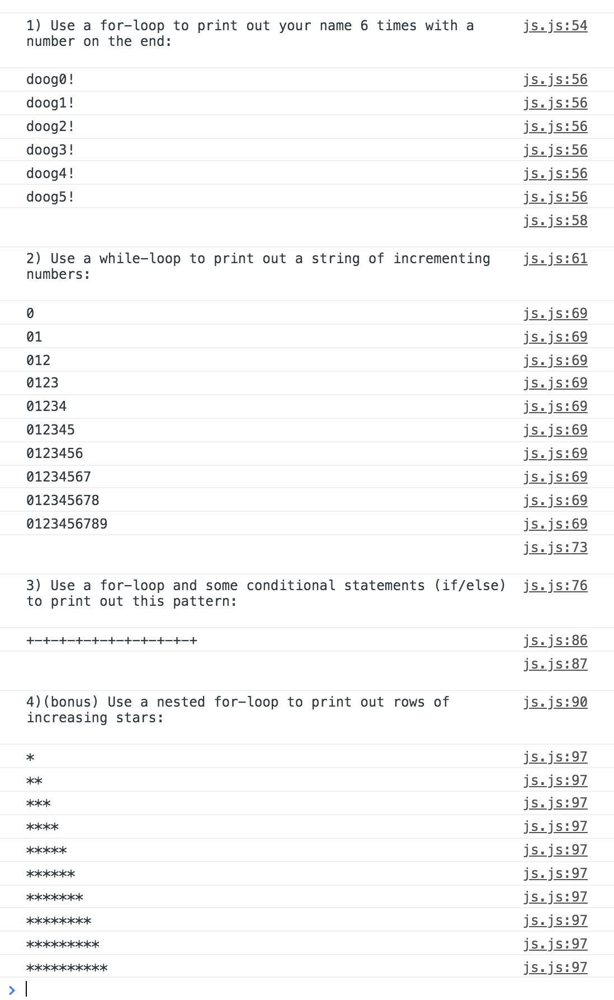

# Assignment: Javascript Loops
__Assigned:__ 10/2/19 (Session 10)<br>
__Due:__ 10/7/19 (Session 11)<br>
__How to submit:__ 1. Upload your site to your GitHub. 2. Post the site link in this Canvas assignment <a href="https://saic.instructure.com/courses/2560557/assignments/24250052" target="blank">here</a>.<br>
___

### Assignment Description:
To practice some of the concepts introduced in class, do your best to solve these code problems! They're hard! but please attempt them. If you can't figure them out, that's okay! Put some comments in your code with questions/comments about parts where you got stuck. We'll go over how to do these at the start of class on 10/07. And don't forget about Slack ;) (please post questions in the <a href="https://saic-webart-fa19.slack.com/messages/CMW267U6S" target="blank">#questions</a> channel!)

In VS Code,
1. Create an HTML file (e.g. js-loops.html)
2. Create a Javascript file (e.g js-loops.js), and link to it in your HTML file using `<script src="your-file.js"></script>` in the bottom of the `<body>` tag.
3. Write code in your Javascript file to print the answers to the following prompts in the Javascript console. (hint: each of your answers will have console.log() in it somewhere!). Your console should look something like this:

4. If you can't get it to print out stuff that looks like the above console-output, write some comments in your code detailing what you're confused about.
5. Upload your finished code to GitHub, and paste the link in Canvas.


#### Example code:
To help you get started, copy and paste all this code at the top of your Javascript. See how the output looks in the console. Follow this example when you try to solve the above problems.

```
// Example: print out a single line of numbers counting backwards from 15 to 1, with a space between each number:
console.log("(Example) Use a for-loop to print out a single line of numbers counting backwards from 20 to 0, with a space between each number:\n\n");

///////// CODE BEGINS HERE /////////

// initialize a string (call it whatever you want, but make it empty!)
let backwardsNums = '';

// your for-loop should begin at 15 and count down, so:
// 1. create a variable 'i' and set it to 15;
// 2. check to see if 'i' is greater than 0. If it is, then go through the loop!
// 3. once the stuff inside the loop happens, decrease the value of 'i' by one.
// note: i-- is the same as i = i-1;
for(let i = 15; i > 0; i--)
{
    // Each time the loop runs, the string backwardsNums grows to include a new number.
    backwardsNums = backwardsNums + i + ' ';
    // you could also write it like this:
    // backwardsNums += i + ' ';

    // uncomment the line below to see what your backwardsNums string looks like at each step of the loop!
    // console.log(backwardsNums);
}

//print out the string to the console:
console.log(backwardsNums);
console.log('\n\n');

// here's the same exact code without all the comments
// let backwardsNums = '';
// for(let i = 15; i > 0; i--)
// {
//     backwardsNums = backwardsNums + i + ' ';
// }
// console.log(backwardsNums);
```

#### Answers:


Note: Number 4 is definitely difficult, because it uses a nested for-loop (a for-loop inside a for-loop!), which we didn't look at in class. But since you know how a single loop works, see if you can think through how a loop inside a loop works.