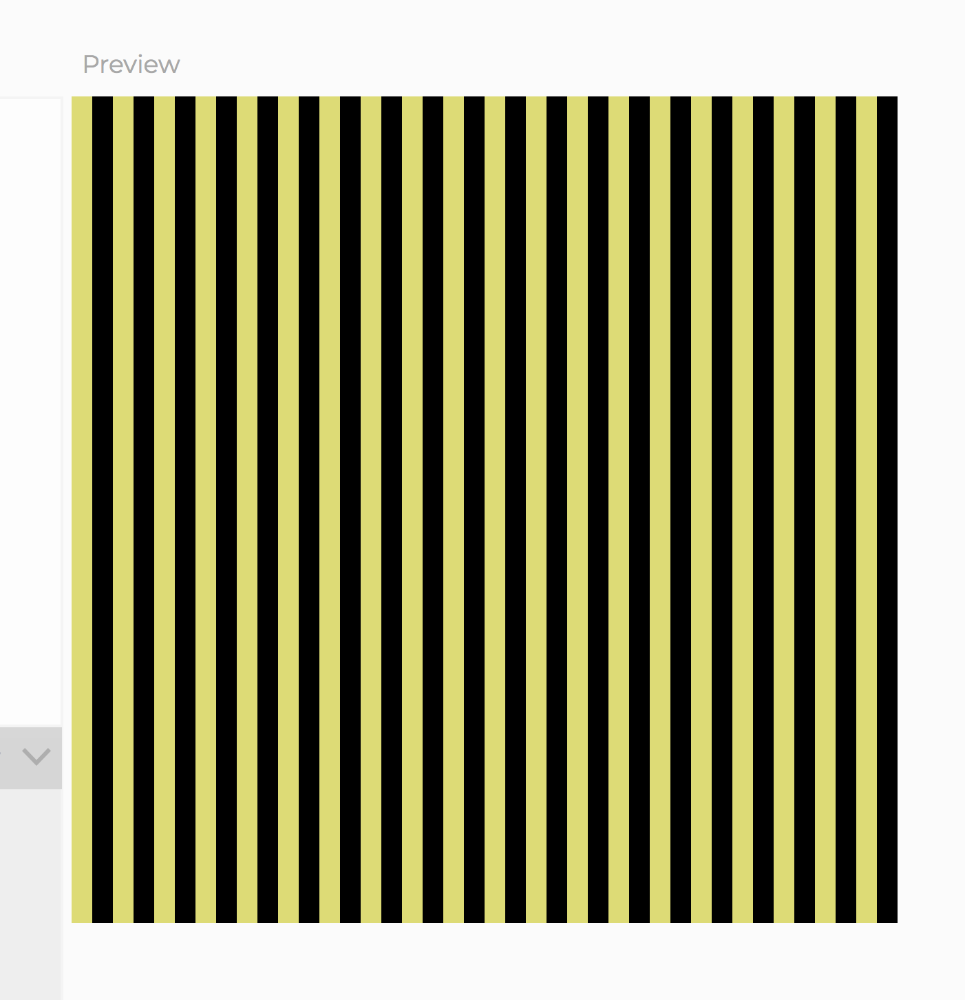
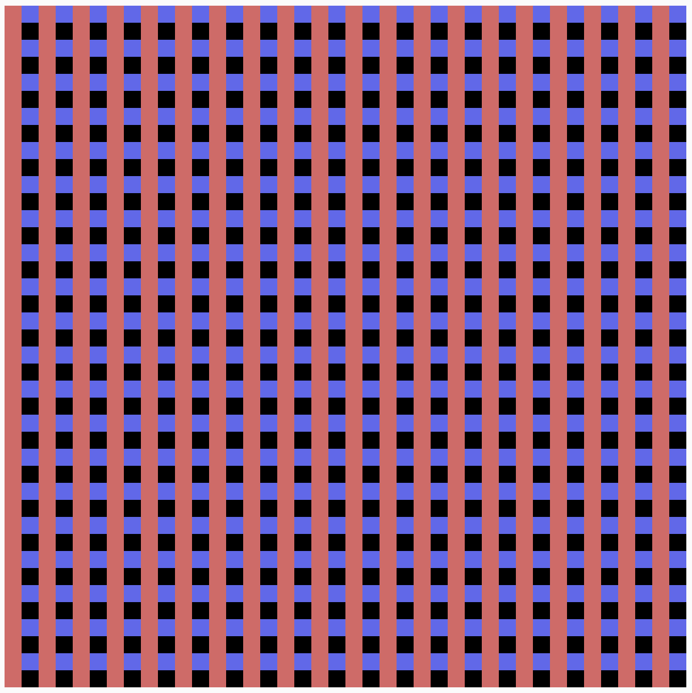
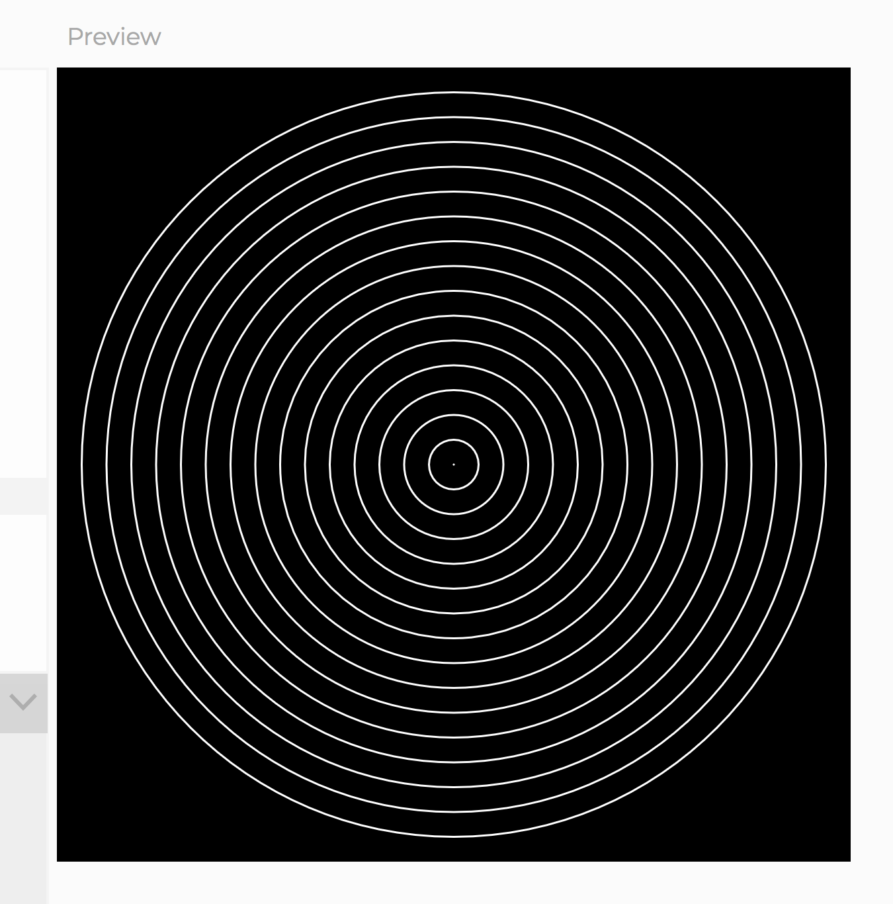
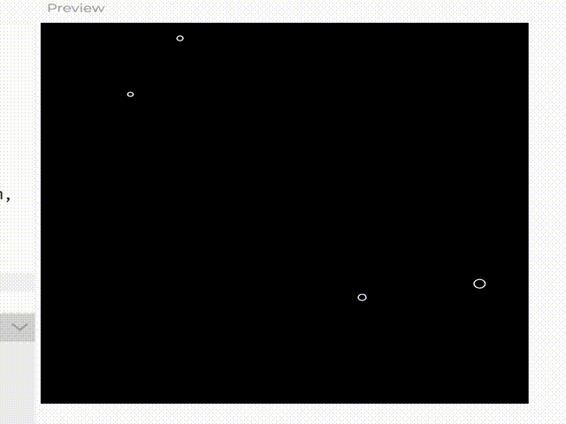

# Assignment: Javascript Loops
__Assigned:__ 10/29/19 (Session ?) 
__Due:__ 10/30/19 (Session ??) 
__How to submit:__ Show me in class!  
___

### Assignment Description:
Practice some p5.js code!

1. Create an account on <a href="https://editor.p5js.org/" target="blank">editor.p5js.org</a> so you can save your sketches!
1. Attempt to recreate the following 3 images and one animation with p5.js code!

(my canvas dimensions are 400, 400)

sketch 00  

sketch 01  

sketch 02  

sketch 03
(the gif is slightly distorted, the circles should just be circles!)  

We'll go over the code in class on Wednesday 10/30. Don't worry if you get stuck, just try your best!  

Tip: if you're struggling with the code, try first describing the images in plain english, and then see if you can translate that into code.

