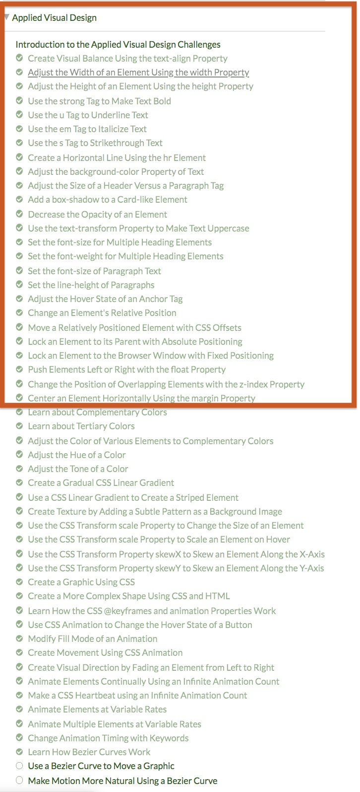

# web art | ARTTECH 3900 | SESSION 03: Beginning HTML/CSS | Sep 9, 2019
___
<a href="../">Home</a> 

<a href="https://dougrosman.github.io/saic-webart-fa19/lectures/session01">Session 01 - 08/28/19</a> |
<a href="https://dougrosman.github.io/saic-webart-fa19/lectures/session02">Session 02 - 09/04/19</a> |
<a href="https://dougrosman.github.io/saic-webart-fa19/lectures/session03">Session 03 - 09/09/19</a> |
<a href="https://dougrosman.github.io/saic-webart-fa19/lectures/session04">Session 04 - 09/11/19</a> |
<a href="https://dougrosman.github.io/saic-webart-fa19/lectures/session05">Session 05 - 09/16/19</a> |

___

#### Schedule:

1. HTML/CSS review
2. Finish artist presentation websites
-BREAK–
3. Artist presentations!!

#### Assignment:

###### Read:
* <a href="https://www.scientificamerican.com/article/long-live-the-web/" target="blank"> <em>Long Live the Web: A Call for Continued Open Standards and Neutrality</em> </a> – Tim Berners-Lee (2010)
* <a href="http://contemporary-home-computing.org/RUE/" target="blank"><em>Rich User Experience, UI, and Desktopization of War</em></a> – Olia Lialina (2014)
* <a href="https://thebaffler.com/salvos/404-page-not-found-wagner" target="blank"><em>404 Page Not Found: The internet feeds on its own dying dreams</em></a> – Kate Wagner (2019)

###### Do:
1. Reading response: Write down one question you have from the readings (just a single question, not one for each reading). We'll discuss briefly in class. <strong>(Due: Monday 09/23/19)</strong>
2. Tutorials: Complete all tutorials in the orange box from the <a href="https://learn.freecodecamp.org/" target="_blank_">Applied Visual Design</a> Tutorials. (<a href="https://learn.freecodecamp.org/responsive-web-design/applied-visual-design" target="blank">click here to start them</a>) <strong>Due Wednesday 09/18/19</strong>
 
