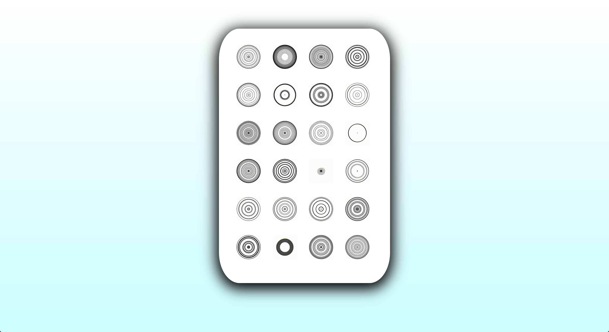

# web art | ARTTECH 3900 | SESSION 06: CSS Positioning | Sep 18, 2019
___
<a href="../">Home</a> 

<a href="https://dougrosman.github.io/saic-webart-fa19/lectures/session01">Session 01 - 08/28/19</a> |
<a href="https://dougrosman.github.io/saic-webart-fa19/lectures/session02">Session 02 - 09/04/19</a> |
<a href="https://dougrosman.github.io/saic-webart-fa19/lectures/session03">Session 03 - 09/09/19</a> |
<a href="https://dougrosman.github.io/saic-webart-fa19/lectures/session04">Session 04 - 09/11/19</a> |
<a href="https://dougrosman.github.io/saic-webart-fa19/lectures/session05">Session 05 - 09/16/19</a> |
<a href="https://dougrosman.github.io/saic-webart-fa19/lectures/session06">Session 06 - 09/18/19</a> |

___

#### Schedule:

1. Presentations
2. Review basic concepts
3. Advanced CSS: Position, Selectors, Box Model, Document Flow, Pseudo elements
-BREAK–
3. Assign homework/work on homework.

___
  
### <a href="https://dougrosman.github.io/saic-webart-fa19/code/session06/flex-phone.html" target="blank">Flex-box phone solution</a>
### <a href="https://dougrosman.github.io/saic-webart-fa19/code/session06/flex-phone-triggers.html" target="blank">Flex-box phone with transitions+triggers</a>
#### Download the code <a href="https://dougrosman.github.io/saic-webart-fa19/downloads/flex-phone-code.zip">here</a>.

___

### <a href="https://dougrosman.github.io/saic-webart-fa19/playgrounds/session06/boxmodel.html" target="blank">CLICK HERE FOR BOX MODEL IN-CLASS DEMO CODE (html)</a>

### <a href="https://dougrosman.github.io/saic-webart-fa19/playgrounds/session06/css/box.css" target="blank">CLICK HERE FOR BOX MODEL IN-CLASS DEMO CODE (css)</a>

#### Assignment:

###### Read:
* <a href="https://www.scientificamerican.com/article/long-live-the-web/" target="blank"> <em>Long Live the Web: A Call for Continued Open Standards and Neutrality</em> </a> – Tim Berners-Lee (2010)
* <a href="http://contemporary-home-computing.org/RUE/" target="blank"><em>Rich User Experience, UI, and Desktopization of War</em></a> – Olia Lialina (2014)
* <a href="https://thebaffler.com/salvos/404-page-not-found-wagner" target="blank"><em>404 Page Not Found: The internet feeds on its own dying dreams</em></a> – Kate Wagner (2019)

###### Do:
* Reading response: Write down one question you have from the readings (just a single question, not one for each reading). We'll discuss briefly in class. <strong>(Due: Monday 09/23/19)</strong>
* Tutorials (optional): Looking for more to do? Finish off all the tutorials in lesson 3 on Free Code Camp <a href="https://learn.freecodecamp.org/responsive-web-design/applied-visual-design" target="blank">here</a>
#### Smartphone webpage: <strong>(Due: Monday 09/23/19)</strong>
Complete a smartphone-like interface to practice CSS positioning and page layout/document flow. Each "phone" must have these properties:

1. <strong>At least 20 "icons"</strong> (though you can do more). That could mean 5 rows of 4 elements, 7 rows of 3 elements, 3 rows of 7 elements, etc.
1. <strong>Each element should display something different</strong>, whether that's an image, a color, a gradient, an animated gif, etc. It can't all be the same horse. Remember, the boxes are just divs, and you can put anything in a div!
1. <strong>Each element should link to something</strong> like another website, a video, etc.
1. <strong> The "phone" should be centered in your browser</strong>
1. <strong> There must be some design element for the background of the whole web page </strong> like a background image or color gradient. Whatever you want!
1. <strong> everything should be positioned proportionally </strong> You can design your "phone" for a certain webpage size–it doesn't have to be totally responsive. Meaning, if you resize your webpage while looking at the thing, it's okay if the dimensions get warped and funky. As long as it looks correct some of the time!
1. <strong> have fun with it! </strong> is this a device someone would use? Does it have apps? what would you call this thing? Make it look nice or make it ridiculous!

Here's mine. It's just a screenshot, but each of those "apps" are animated GIFs that are moving indepedendently. I created the GIFs using Processing. You'll see it on Monday!

_Note: I added a little shadow to the phone using the box-shadow property. Google CSS box shadow if that interests ya!_

 